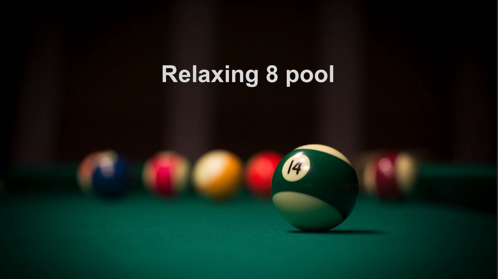
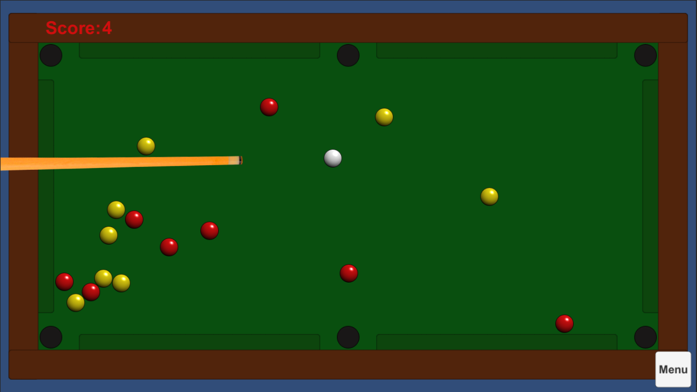
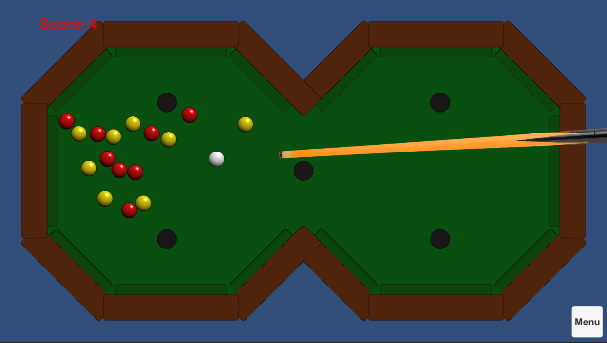

# Relaxing-8-Pool
Solo player 8-pool 2D game.

I did it for a technical test, Unity developer job offer.

**Goal**: Write a minimalist 1 player 2D pool game.

## Features:
- Tested on Android and Windows.
- 3 shots controllers supported Mouse, Keyboard and Touch.
- 2 levels are playables.
- Trajectory prediction simulation was implemented with Multi-scene physics. 
- Quick stack based menu implemented.
- All graphics are batched or Instanced by GPU when possible. ( >15 draw calls during a game).
- Audios can be muted ( Music or fxs ).

## Remarks:
- It was design for 16:9 screen ratio, I don't consider other ratios for now.

## Controls:
- Mouse and Touch :
    - Click down or touch down + drag to add power
    - Release mousebutton or touch to shot
- Keyboard:
    - Increase/Decrease Force with Up/Down arrow keys.
    - Turn the cue with Right/Left arrow keys.
    - And Shot by smatching the space key.

Standard              |  Infinity
:-------------------------:|:-------------------------:
  |  
